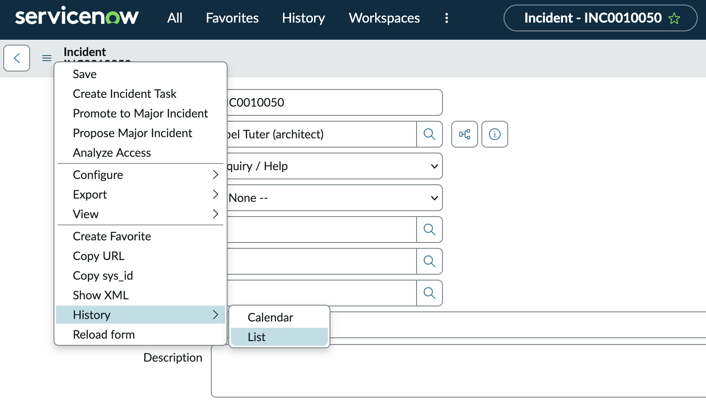

## Viewing Who Did What
There will be times you need to understand who did what to a ticket. Most of our common tables (Incidents, Cases, Users etc) all have auditing turned on. 

To get started, click on the **Hamburger Menu** in the top left corner (The horizontal 3 lines in our screenshot below). Towards the bottom of the menu will be **History** and you want the **List View** if it's available. 

