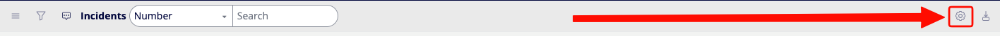
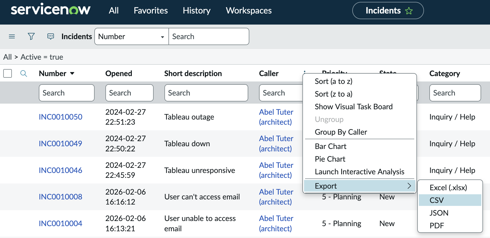

Now that you’ve filtered your list view down to what you want, how can you export it? You can export data from your list into a CSV, but it’s important to understand your CSV will only have the columns in your display, so let’s first make sure you have all of the columns you need. To get started, click on the gear icon in the upper right corner.

Once you click on that gear, a new window will pop up and you can choose which columns are in your view, along with rearranging the order of them. It’s important to understand these changes apply to you only, so no one else will be impacted by this.

Once your list view is showing you all of the columns you want, you can right click on any column header and select the **Export** option. I highly recommend using the *CSV* option instead of *Excel*, but feel free to experiment. Please note, you will not see all of the options in the below screenshot.

!!! info
    The changes you make here will only impact you. 

