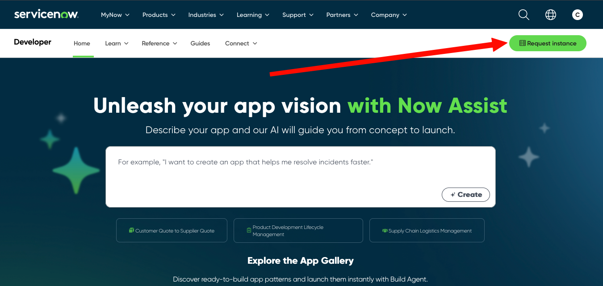
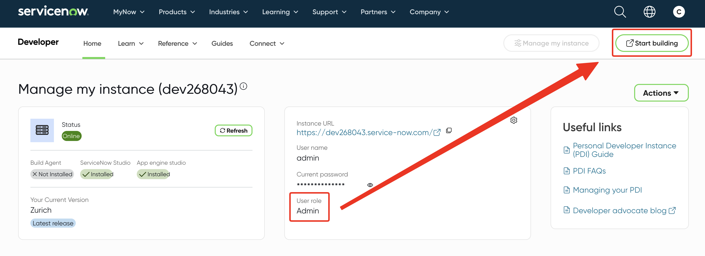

Personal Development Instances (PDIs) are an incredibly useful feature. Whether you just want to learn more about ServiceNow, or try out some crazy idea without breaking our Development instance...PDIs are the answer. 

!!! tip
    These PDIs are fully unlocked, giving you access to just about every module ServiceNow offers. The only exception to this is the Now Assist stuff due to the additional strain on resources used by Now Assist. 

    In other words, you'll have admin access to your own ServiceNow instance to do whatever you want in it. 

PDIs are available to anyone (free of charge) by simply registering for an account at [developer.servicenow.com](https://developer.servicenow.com){:target="_blank"}. 

Once you have registered there you can use their Request Instance button in the top right. 

You will want to select whatever the latest release is. As of the writing of this document it's **Zurich**. 

Once you submit your request you'll be taken back to the **Manage Instance** page on their site. It will take 5 or 10 minutes for your instance to be ready. 

While you are waiting, there's two main caveats to remember with PDIs

1. They will be shut down each night. You can *wake* them from the **Manage Instance** section again. This process will take a good 5 or 10 minutes. 
1. If you don't log in and use your PDI within 7 or 10 days, they will reclaim it. You will get an email warning sent to your account before this happens. If it is reclaimed, you can simply request a new one when you need it again. 

Once your instance is finished being setup, you'll see a screen like this. You'll want to confirm your **User role** is `Admin` and then click on the **Start Building** button to log in. 

