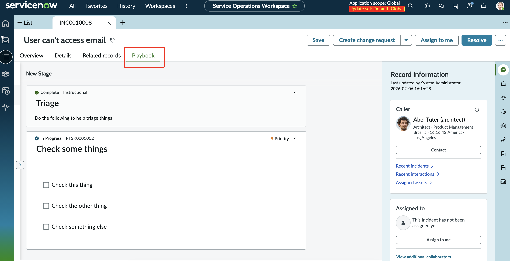
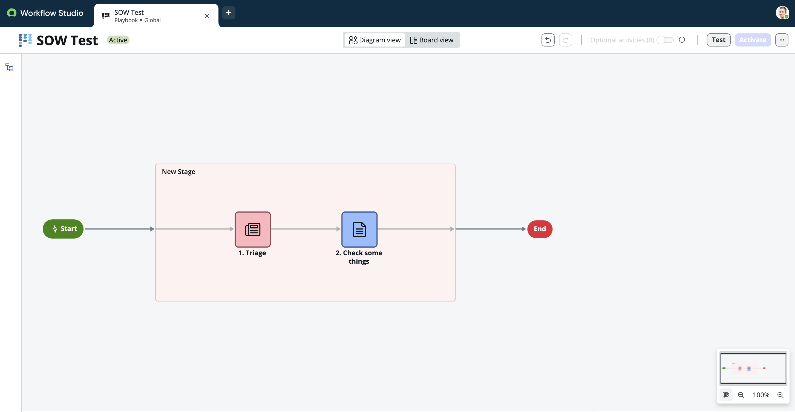

## Standarizing and Automating Workflow
Playbooks are a powerful new feature to ServiceNow that can help ensure consistency in how we handle given tickets, and also perform automation wherever possible. If we go back to our Michelin 5 Star Kitchen analogy...Playbooks are the recipe cards baked right into our Service Operations Workspace. 

Playbooks can be triggered on any number of criteria and have a variety of things they can do. 
1. Provide instructions
1. Generate a check list of steps to perform
1. Generate a Questionaire to help capture input from the fulfiller handling the task
1. Make complex workflow decisions based on previous steps or answers

Best of all, playbooks can be written in an hour or less. 

And the below screenshot shows you what they look like when designed in Workflow Studio. 

