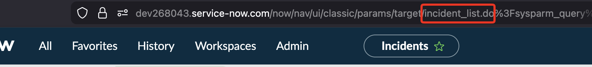
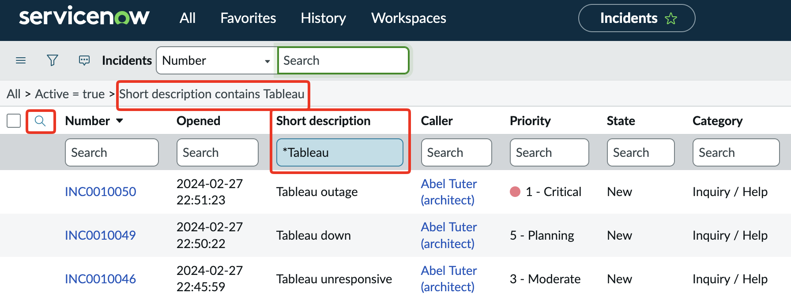
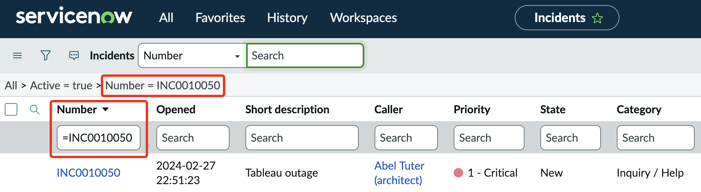
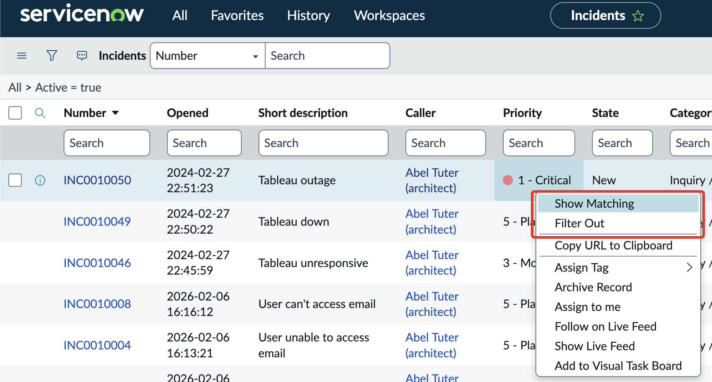
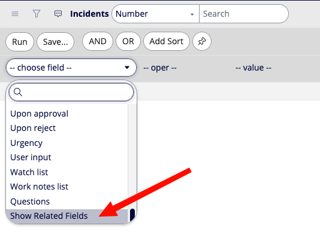
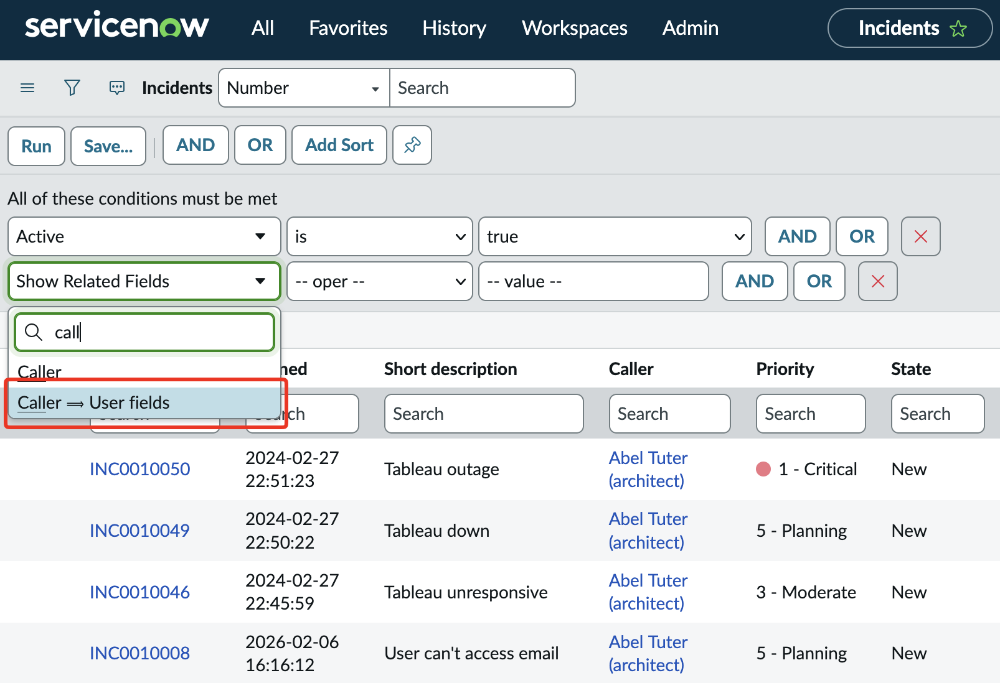
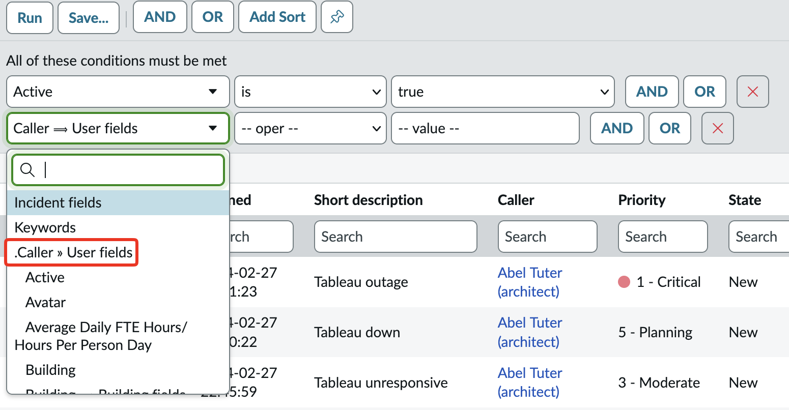
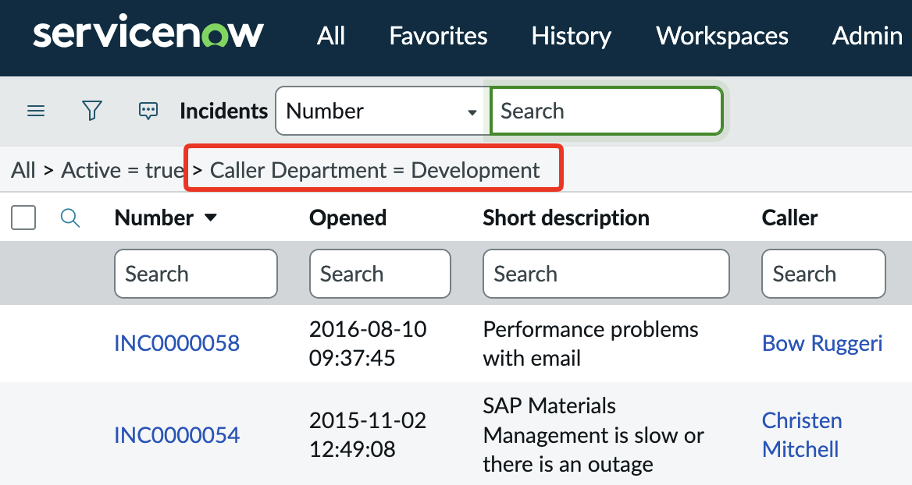

# Everything is a record in a table
Within ServiceNow, Everything is a record in a table. Some of the most common tables you’ll interact with are

- Incidents (INC): `incident`
- Requests (REQ): `sc_request`
- Request Items (RITM): `sc_req_itms`
- Change Requests (CHG): `change_request`

If you want to find the table you’re working on, you can always look at the URL in your browser and you’ll see something like this:

In the above example we see `incident_list.do`. Our table name here is `incident` and the `_list.do` part just says we're in list view. 

# Simple Searching
Sometimes you want to quickly search for something in your list view via a column. You’ll first have to turn on that view by clicking the magnifying glass, but once you do, you’ll be able to search for text in any column.

!!! tip "Searches are CaSe INSensITive"
    It's important to understand searches in ServiceNow are case insensitive. In other words, whether you search for "Please", "please", or "PlEAsE" you will get the same results 

In the above example you’ll see I searched for `*Tableau` and that `*` is important. It tells ServiceNow to search all Incidents for any records that contain the word **Tableau** in the short description. You can also use the `=` prefix for exact matches.

This would be useful if you were trying to find something like a ticket number.

Lastly, you can also click on any cell in any column and either **Show Matching** or **Filter Out** that result from your search.

# Dot Walking
!!! tip
    Dot Walking is one of the more powerful parts of the platform. It's worth taking the time to make sure you really understand this concept. 

Sometimes you want to filter on a piece of data that’s not on the **Incident** table, but is related to the **Caller** (or some other reference field). This is where dot walking comes in, and it’s something you’ll have to first setup. Instead of searching for a field, scroll to the very bottom and you should see **Show Related Fields**. Click on this and you’ll go back to the same search box, leaving you to think nothing happened.

But in reality, the list of fields you can now filter on has grown to encompass any related tables. When you click on the filter box again, you’ll see some entries now have a `==>` pointing to another table. For example, if I wanted to search based on **Caller** but I only wanted to see Incidents where the caller is from the *Development* group.

Now I can look for the Department field in this list, which allows me to search for “Caller -> Department”

You can extend this dot walking ability as far as established relationships will let you. Dot walking is an incredibly useful and powerful ability, so I highly recommend taking some time to understand it.

This dot walking concept also extends to things like Flow Designer as well.