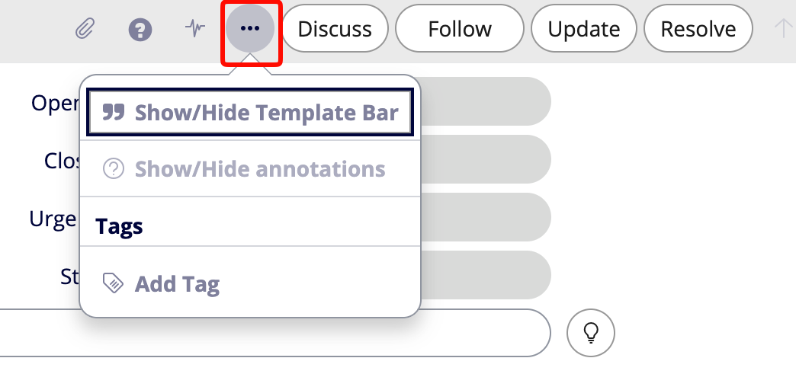

Another very useful feature is Templates in ServiceNow. While any user can create their own templates, only select individuals can share those templates with a group of people (or everyone).

Templates are useful for quickly creating a record, or modifying an existing record.

To get started with templates, you’ll first need to enable the template viewer on any given table. 

Once you have clicked on the **Show/Hide Template Bar** you’ll see a bar pop up at the bottom of your screen. On the far right side of this bar is a `+` symbol. If you click on this `+` from an existing record, the template you create will be based off of that record. You can then modify the template as needed. 