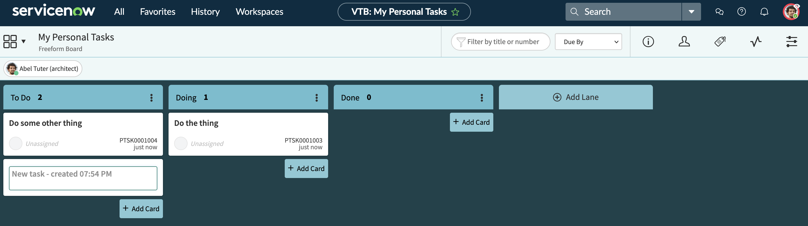
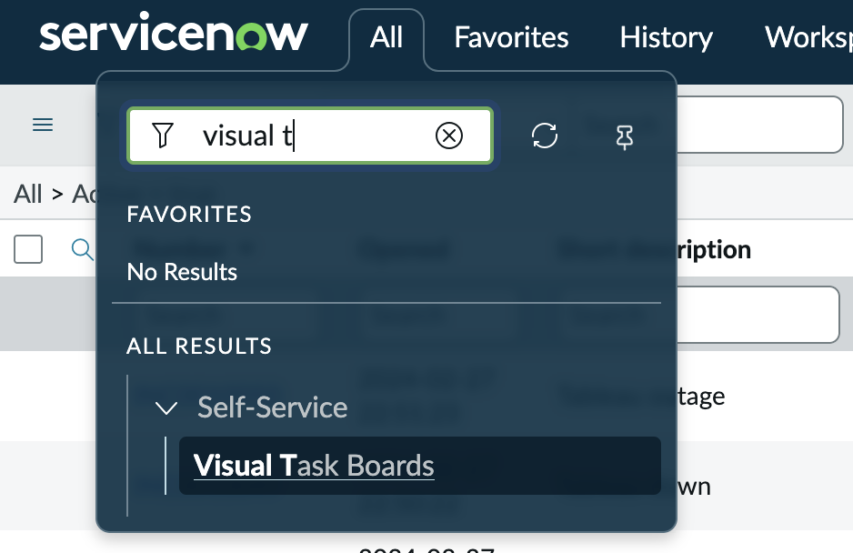

## Understanding Visual Task Boards in ServiceNow

Visual Task Boards (VTBs) provide a simple, card‑based interface for organizing and tracking work. They present tasks as movable cards arranged in lanes, giving users a clean, drag‑and‑drop experience similar to Kanban boards. ServiceNow offers two major types of VTBs: **Freeform boards**, which allow users to create personal or ad‑hoc tasks and fully customize lanes, and **Data‑Driven boards**, which pull live records from a table (such as Incidents or Project Tasks). Freeform boards are completely flexible—users can add any task they want, modify lane names, and structure their board however they like. Data‑Driven boards, on the other hand, automatically populate with tasks based on filters, and lanes can be guided (based on a field like *State*) or flexible (default lanes users can edit). [1](https://www.servicenow.com/community/next-experience-forum/blog-visual-task-boards-vtb-types-a-complete-servicenow-guide/td-p/3475077){:target="_blank"}

!!! info
    To get check out Visual Task Boards, click on **All** and type in `Visual Task`. It should pop right up

One of the key strengths of Visual Task Boards is how quick and simple task creation becomes. On Freeform boards, users can add cards instantly without creating formal task records in the system. These personal tasks stay private unless the user chooses to share the board. Even on Data‑Driven boards, users can supplement system‑generated cards by adding custom ones, giving them a mix of structured work and personal reminders. Labels can be created and customized at will, allowing users to categorize tasks visually with color‑coding. Swimlanes can also be enabled on Data‑Driven boards to group tasks horizontally—such as by assignment group, priority, or any other field—creating additional clarity and organization. [2](https://ucdavisit.service-now.com/servicehub/?id=ucd_kb_article&sysparm_article=KB0007804){:target="_blank"}

Because VTBs are customizable and user‑controlled, they work especially well for personal task management or team collaboration without cluttering the main task tables. Users can rename lanes, add or remove them, set lane limits, and drag cards to update their status when working on guided boards (which update the underlying record) or keep changes private on flexible or freeform boards (which do not alter the real record unless configured). This flexibility makes Visual Task Boards a powerful tool for managing work visually while keeping the user experience simple, private, and intuitive. [3](https://oit.gatech.edu/sites/default/files/documents/ITBM/srpt104_-_using_visual_task_boards.pdf){:target="_blank"}